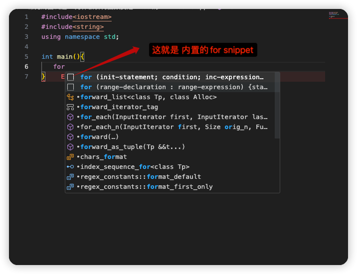
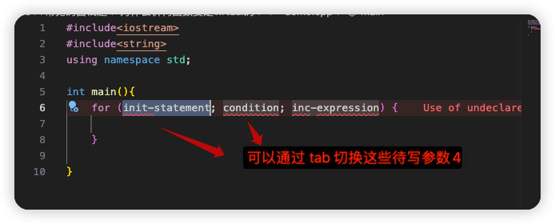
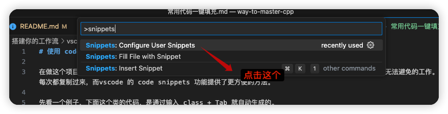
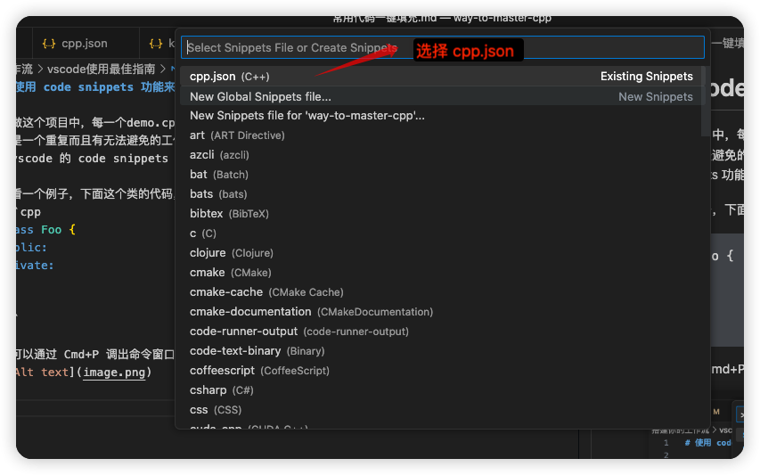

# 使用 code snippets 功能来快速生成常用代码

## 一、功能介绍
### 1. 什么是 snippets 功能？
其实大家可能体验过vscode 预先内置的许多 snippets, 比如 for 循环。
在输入 for + Tab  的时候，就可以自动生成代码模版，



展开就是这样的代码


**有一个小窍门是通过 tab 键可以在参数之间进行跳转**，比移动鼠标更加方便。

### 2.为什么需要配置自己的 snippets？

很简单，内置的snippets不能满足需求。比如在做这个项目中，每一个demo.cpp 都需要 `include <iostream>` 以及 写 main 函数，这是一个重复而且有无法避免的工作。当然，我也可以写一个 模版文件，然后每次都复制过来，这也不方便，幸好vscode 的 code snippets 功能提供了更快捷优雅的方法。

例子：在做一些简单的配置之后，就可以通过输入 `inc + Tab` 生成下面这一个常用的代码。
```cpp
#include<iostream>
#include<string>
using namespace std;

int main(){


}
```

## 二、如何配置
首先 Cmd+Shift+P 调出命令窗口(linux 应该是 Ctrl+Shift+P),输入 `snippets`



然后选择你的语言， 这里我以 C++ 为例，不同语言的 snippets 是存放在单独的配置文件里。


然后你就可以配置你自己的代码片段了，这里我给个自己的配置例子 

```json
{
	"C++ main template":{
		"prefix" : "inc",
		"isFileTemplate": true,
		"body":[
			"#include<iostream>",
			"#include<string>",
			"using namespace std;\n",
			"int main(){\n\n",
			"}"
		]
	},
	"C++ class": {
		"prefix": "class",
		"body":[
			"class ${0:class_name} {",
			"public:\nprivate:\n",
			"};"
		]
	}

}
```
- prefix 是触发词
- body: 是生成的语句
- ${0:class_name} 是待手写的参数，你也可以用多个参数。

可以看出 第一个是通过 `inc` 快速生成一个可执行的 main 函数代码，并引入了常用头文件。

第二个则是通过 `class` 来产生类代码，这里尤其是类后面那个分号，我经常忘了写，使用 snippets 就完美解决了这个麻烦。

`isFileTemplate` 提供了第二种用法，即通过 控制台命令来填充 snippets，这个感觉还不如触发词方便，就不介绍了。

更多 snippets 的使用方法参考 vscode [User guide](https://code.visualstudio.com/docs/editor/userdefinedsnippets#:~:text=To%20create%20or%20edit%20your,should%20appear%20for%20all%20languages.)
